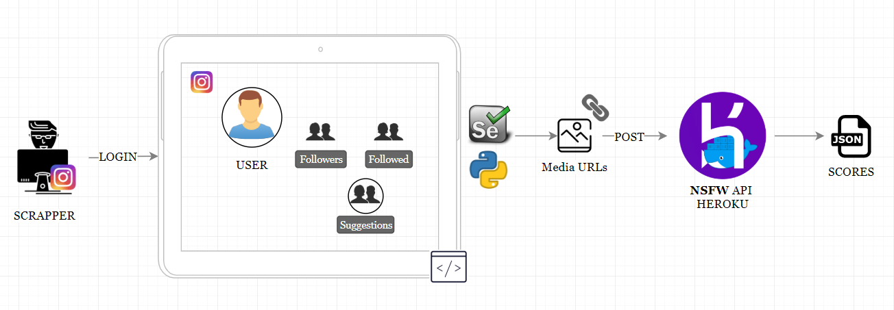

Instagram Scrapping: contribución **Departamento de Ideas Locas** Telefónica CDO
------------
El presente repositorio es fruto del rápido desarrollo de una PoC se basa en el repositorio [Instagram Scrapper](https://github.com/rarcega/instagram-scraper), el cual te permite obtener una gran cantidad de información de un usuario a través de su perfil de Instagram, siempre y cuando sea un perfil público o sea amigo del perfil representado por las credenciales que se usan para lanzar el servicio. En el caso de que el perfil sea privado y no sea amigo del perfil desde el que se hace scrapping, se hace un análisis de las imágenes de los perfiles sugeridos.

[Instagram Scrapper](https://github.com/rarcega/instagram-scraper) se ha querido completar con un servicio de detección de imágenes sesgado hacia contenido explícito. Para ello se ha hecho uso de [Nudity image detection HTTP API](https://github.com/EugenCepoi/nsfw_api). Este proyecto proporciona una API REST lista para implementar que permite predecir si una imagen es ofensiva o tiene contenido para adultos. 

<div style="text-align:center">

</div>

Para realizar la prueba, se procedió a desplegar el servicio en Heroku, [tal y como se explica en esta sección](https://github.com/EugenCepoi/nsfw_api#running-on-heroku). De esta manera, se pueden recoger las urls del contenido multimedia de interés y, haciendo un POST de un batch de urls, se puede obtener el nivel de idoneidad para el consumo de esa imagen (siendo 0 muy adecuada y 1 no adecuada en absoluto).

Resumen de uso
------------
En esta PoC se hace uso tanto de los siguientes WebDrivers para poder hacer el scrapping del contenido HTML:
* [ChromeDriver - WebDriver for Chrome](http://chromedriver.chromium.org/) 
* [GeckoDriver - WebDriver for Firefox](https://firefox-source-docs.mozilla.org/testing/geckodriver/)

Hay que incluir en el PATH las rutas en las que los drivers se encuentren. Para **Linux** basta con ejecutar:
```bash
$ export PATH=$PATH:/path/to/driver/chrome-driver
```
```bash
$ export PATH=$PATH:/path/to/driver/gecko-driver
```
Para añadir al PATH en **Windows**, se pueden seguir los [siguientes pasos](https://helpdeskgeek.com/windows-10/add-windows-path-environment-variable/).

### Obtencíon de las fotografías de un perfil y análisis de idoneidad

```bash
$ python app.py @insta_args.txt username
```

**Requisitos**: 
1. Tener un perfil de Instagram. Las credenciales a usar se introducen en un fichero llamado `insta_args.txt`.
2. El perfil a scrapear debe ser público o deber ser su amigo para poder acceder a todo su media (imágenes, vídeos, stories, comentarios, likes…). Se hace uso de la API de Instagram. En esta PoC nos remitimos sólo a las imágenes.

**Outputs**
1. Descarga de todos los contenidos multimedia del perfil de Instagram
2. Generación de un fichero `.json` con metadatos del contenido multimedia.
3. Generación de un fichero `.json` con las scores de las urls obtenidas desde el servicio NSFW API.

[Muestra `python app.py @insta_args.txt username`](https://youtu.be/8gQt43T5HnU)


### Obtencíon de las fotografías de los perfiles seguidos por un usuario y análisis de idoneidad

```bash
$ python app_followers.py @insta_args.txt username
```
**Requisitos**: 
1. Tener un perfil de Instagram. Las credenciales a usar se introducen en un fichero llamado `insta_args.txt`.
2. El perfil a scrapear debe ser público o deber ser su amigo para poder acceder a las fotografías de los seguidores.

**Outputs**
1. Generación de un fichero `.json` con las scores de las urls de los usuarios seguidores obtenidas desde el servicio NSFW API.

[Muestra `python app_followers.py @insta_args.txt username`](https://youtu.be/k0H8mRcb9Zo)

### Obtencíon de las fotografías de los perfiles seguidos por un usuario y análisis de idoneidad

```bash
$ python app_followed.py @insta_args.txt username
```
**Requisitos**: 
1. Tener un perfil de Instagram. Las credenciales a usar se introducen en un fichero llamado `insta_args.txt`.
2. El perfil a scrapear debe ser público o deber ser su amigo para poder acceder a las fotografías de los usuarios seguidos por el perfil.

**Outputs**
1. Generación de un fichero `.json` con las scores de las urls de los usuarios seguidos por el perfil obtenidas desde el servicio NSFW API.

[Muestra `python app_followed.py @insta_args.txt username`](https://youtu.be/PuNIELuiGFQ)

### Obtencíon de las fotografías de los perfiles sugeridos por un usuario y análisis de idoneidad

```bash
$ python app_suggestions.py @insta_args.txt username
```

**Requisitos**: 
1. Tener un perfil de Instagram. Las credenciales a usar se introducen en un fichero llamado `insta_args.txt`.
2. El perfil a scrapear es privado y no se es amigo del perfil. Se accede a las fotografías de los usuarios sugeridos tras haber hecho login.

**Outputs**
1. Generación de un fichero `.json` con las scores de las urls de los usuarios sugeridos obtenidas desde el servicio NSFW API.

[Muestra `python app_suggestions.py @insta_args.txt username`](https://youtu.be/OBNdPvdVcPg)

Licencia
-------
This is free and unencumbered software released into the public domain.

Anyone is free to copy, modify, publish, use, compile, sell, or
distribute this software, either in source code form or as a compiled
binary, for any purpose, commercial or non-commercial, and by any
means.

In jurisdictions that recognize copyright laws, the author or authors
of this software dedicate any and all copyright interest in the
software to the public domain. We make this dedication for the benefit
of the public at large and to the detriment of our heirs and
successors. We intend this dedication to be an overt act of
relinquishment in perpetuity of all present and future rights to this
software under copyright law.

THE SOFTWARE IS PROVIDED "AS IS", WITHOUT WARRANTY OF ANY KIND,
EXPRESS OR IMPLIED, INCLUDING BUT NOT LIMITED TO THE WARRANTIES OF
MERCHANTABILITY, FITNESS FOR A PARTICULAR PURPOSE AND NONINFRINGEMENT.
IN NO EVENT SHALL THE AUTHORS BE LIABLE FOR ANY CLAIM, DAMAGES OR
OTHER LIABILITY, WHETHER IN AN ACTION OF CONTRACT, TORT OR OTHERWISE,
ARISING FROM, OUT OF OR IN CONNECTION WITH THE SOFTWARE OR THE USE OR
OTHER DEALINGS IN THE SOFTWARE.
________________________________________

